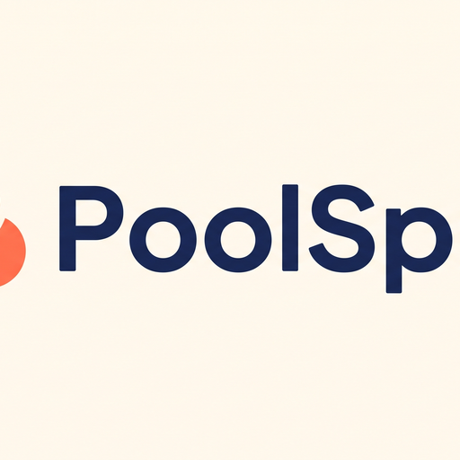

<div align="center">
  

  <h1>PoolSplit</h1>

  **What are we doing this weekend?**

  <p>
    Find something fun. Invite your people. Make it happen — and settle up without the awkward math.
  </p>

  <p>
    <a href="#quick-start">Quick Start</a> •
    <a href="#deploy-with-dokploy">Deploy (Dokploy)</a> •
    <a href="#domain-setup">Domain Setup</a> •
    <a href="#local-development">Local Dev</a> •
    <a href="#api">API</a> •
    <a href="#architecture">Architecture</a>
  </p>

  <p>
    
    
    
  </p>
</div>

---

## ✨ Features

| Feature | Description |
|---------|-------------|
| **Groups & Outings** | Create groups, plan outings, invite by public ID or QR |
| **Flexible Expenses** | FIXED (per-unit pricing) or VARIABLE (custom line items) |
| **Per-Activity Participation** | Not everyone joins every activity — track per-activity |
| **Contributions ≠ Payments** | Who consumed vs who actually paid tracked separately |
| **Automatic Settlement** | Debt simplification math — knows who owes whom |
| **Wallet** | Deposit funds, track balance, contribution history |
| **Trilingual UI** | English, Français, العربية with full RTL support |
| **Friendship Modes** | Mixed, Guys, Girls color themes |
| **Dark Mode** | System-follow or manual toggle |
| **QR Invites** | Scan to join groups and outings |
| **Public Settlement Links** | Share settlement results without login |

---

## 🚀 Quick Start

### Local Development

```bash
git clone https://github.com/Elouahabi-Naoufal/poolsplit.git
cd poolsplit

cp .env.example .env
# Generate a secret:
#   openssl rand -base64 32

npm install
npx prisma migrate dev
npx prisma generate
npm run dev
# → http://localhost:3000
```

### Docker (Single VPS)

```bash
git clone https://github.com/Elouahabi-Naoufal/poolsplit.git /opt/poolsplit
cd /opt/poolsplit
cp .env.example .env
# Edit JWT_SECRET in .env

mkdir -p data
docker compose up --build -d
# → http://YOUR_VPS_IP:3003
```

The app ships with a `docker-entrypoint.sh` that:
- Runs Prisma migrations automatically on startup
- Enables SQLite **WAL mode** for concurrent reads/writes
- Drops privileges from root to the `nextjs` user
- Persists data in a named Docker volume (`hesab-data`)

---

## 🏭 Deploy with Dokploy

[Dokploy](https://dokploy.com) is an open-source PaaS that manages Docker Compose deployments via a web UI. It runs on your own VPS and integrates with GitHub, Traefik + Let's Encrypt for automatic SSL.

### Prerequisites

- A VPS (Ubuntu 22+/Debian 12) with Docker installed
- Dokploy running on your VPS (installed via their install script)
- A domain name pointing to your VPS IP
- A GitHub repository containing this project

### Step 1: Create a Compose Project in Dokploy

1. Log into your Dokploy dashboard (e.g., `https://dokploy.yourdomain.com`)
2. Navigate to **Projects** → **New Project**
3. Give it a name (e.g., "Web Apps")
4. Inside the project, click **New Compose**
5. **Source Type**: GitHub
6. **Repository**: `Elouahabi-Naoufal/poolsplit`
7. **Branch**: `main`
8. **Compose Path**: `./docker-compose.yml`
9. **Auto Deploy**: Enable

### Step 2: Add Environment Variables

In the Dokploy compose settings, add these environment variables:

| Variable | Value | Purpose |
|----------|-------|---------|
| `JWT_SECRET` | `openssl rand -base64 32` | Session signing key |
| `NODE_ENV` | `production` | Production mode |

Dokploy writes these into a `.env` file next to `docker-compose.yml`. The DATABASE_URL is already hardcoded in the compose file (`file:/app/data/app.db`), and data persists in a named volume.

### Step 3: Deploy

Click **Deploy**. Dokploy will:
1. Clone the repo
2. Build the Docker image (multi-stage, ~2-3 min)
3. Start the container
4. The app is now running on an internal port behind Traefik

---

## 🌐 Domain Setup

PoolSplit runs behind **Traefik** (shipped with Dokploy). To connect your domain:

### Option A: Dokploy Domain Tab (Recommended)

1. In Dokploy, open your compose → **Domains** tab
2. Click **New Domain**
3. Enter your domain: `poolsplit.yourdomain.com`
4. Dokploy auto-configures Traefik and provisions a Let's Encrypt SSL certificate
5. **Propagation**: Wait 5-10 minutes for DNS

### Option B: Manual Traefik (Standalone Deploy)

If you're not using Dokploy but running Traefik separately, add a file provider config:

```yaml
# /etc/traefik/dynamic/poolsplit.yml
http:
  routers:
    poolsplit:
      rule: "Host(`poolsplit.yourdomain.com`)"
      service: poolsplit
      tls:
        certResolver: letsencrypt
  services:
    poolsplit:
      loadBalancer:
        servers:
          - url: "http://HOMESERVER_LAN_IP:3003"
```

Then point your DNS `A` record to your VPS IP and Traefik handles the rest.

### DNS Records

| Type | Name | Value |
|------|------|-------|
| A | `poolsplit` | `YOUR_VPS_IP` |
| A | `dokploy` | `YOUR_VPS_IP` (for admin dashboard) |

---

## 🏗 Architecture

```
src/
├── app/              # Next.js App Router pages
│   ├── [locale]/     # Localized routes (en, fr, ar)
│   └── api/          # API routes (auth, join)
├── components/       # React components (AppShell, icons, theme toggles)
├── domain/           # Pure business logic (money, settlement, allocation)
├── lib/              # Prisma client, utilities, avatar helpers
├── server/           # Server actions (auth, groups, outings, activities, wallet)
│   ├── auth/         # Login, register, session
│   ├── groups/       # Group CRUD, invitations
│   ├── outings/      # Outing lifecycle
│   ├── activities/   # Activity CRUD
│   ├── payments/     # Payment recording
│   ├── settlement/   # Finalize / recalculate / confirm transfers
│   └── wallet/       # Deposit, transaction history
└── i18n/             # Internationalization config
```

### Key Design Decisions

- **SQLite + WAL**: Zero external dependencies. A single `app.db` file, backed up with `cp`. WAL mode enables concurrent reads during writes.
- **Integer Centimes**: All money is `Int` (centimes). 100 DH = 10,000 centimes. No floating point anywhere.
- **Server Actions over API Routes**: Next.js server actions for mutations (type-safe, no extra HTTP layer). REST API routes only for public endpoints (join, auth check).
- **Deterministic Rounding**: `allocateEqual` distributes remainders 1 centime at a time (Largest Remainder Method). The system is provably fair.

---

## 📋 Environment Variables

| Variable | Required | Default | Description |
|----------|----------|---------|-------------|
| `DATABASE_URL` | Yes | `file:/app/data/app.db` | SQLite path (absolute for Docker) |
| `JWT_SECRET` | Yes | — | 32+ char random string for session signing |
| `PORT` | No | `3003` | HTTP listen port |
| `NODE_ENV` | No | `production` | `development` / `production` |

---

## 🔧 Tech Stack

| Layer | Technology |
|-------|-----------|
| Framework | [Next.js 16](https://nextjs.org/) (App Router, Turbopack) |
| UI | [React 19](https://react.dev/), [Tailwind 4](https://tailwindcss.com/) |
| Database | [SQLite](https://sqlite.org/) (WAL mode) via [Prisma 5](https://prisma.io) |
| Auth | [bcryptjs](https://github.com/dcodeIO/bcrypt.js) + [jose](https://github.com/panva/jose) (JWT) |
| Validation | [Zod](https://zod.dev/) |
| i18n | [next-intl](https://next-intl.dev/) (en, fr, ar, RTL) |
| Container | [Docker](https://docker.com/) (multi-stage, 105MB final image, distroless-like) |
| Deployment | [Dokploy](https://dokploy.com/) (open-source PaaS) |

---

## 🤝 Contributing

1. Fork the repository
2. Create your feature branch (`git checkout -b feat/amazing`)
3. Commit your changes (`git commit -m 'feat: add amazing feature'`)
4. Push to the branch (`git push origin feat/amazing`)
5. Open a Pull Request

---

## 📄 License

Distributed under the **MIT License**. See `LICENSE` for more information.

---

<div align="center">
  <sub>Built with ❤️ by <a href="https://github.com/Elouahabi-Naoufal">Naoufal El Ouahabi</a></sub>
</div>
